# Week 1

### Task 1

> Identify a theme for your dataset. This will be the central, cohesive strand that will bring your data together. It can be an artist, composer, songwriter, performer, album, larger work (i.e. opera, musical, etc.), time period, genre, archival grouping, etc. You will want to be sure that you can gather all three types of data (musical scores, metadata, and audio recordings) based on your selected theme. 

For my data set I have chosen Bela Bartok. Béla Bartók (1881–1945) stands as one of the 20th century's most influential and innovative composers, ethnomusicologists, and pianists. Born in Hungary, Bartók's musical journey began with a profound appreciation for the folk traditions of his homeland. His pioneering work in ethnomusicology involved extensive fieldwork, where he traveled through remote villages, recording and preserving the rich tapestry of Eastern European folk music.

Bartók's compositional style evolved, blending folk elements with modernist techniques. His music is characterized by rhythmic vitality, unconventional scales, and intricate harmonies, reflecting a deep exploration of both classical and folk idioms. Pieces such as "Mikrokosmos" and "Music for Strings, Percussion, and Celesta" showcase his mastery in fusing folk motifs with avant-garde elements.

### Task 2

>  Based on your own experience, what do you think are some challenges to working with music and music-related data (perhaps related to access, curation, distribution, etc.)? How does your selected theme display some of these challenges? Describe the current manifestations of data relating to your selected theme, discussing how it is presently curated (collected and gathered) and how it is presented, described, and analysed.

**Data Fragmentation:** Data fragmentation is a result of the fact that music-related data is frequently available across a range of platforms, databases, and formats. This makes it difficult to have a complete and centralised dataset for analysis. There are several ways that independent musicians, record labels, and streaming platforms store and share data.

**Copyright and Licencing Issues:** Because of copyright and licencing issues, accessing and utilising music data for analysis can be challenging. Since the music industry is so heavily regulated, it might be difficult to get the licences needed in order to utilise and analyse particular datasets.

**Data Quality:** For analysis to be meaningful, data connected to music must be accurate and of high quality. Research efforts might be hampered and findings misled by incomplete or erroneous metadata, mislabeled tracks, and inconsistent data entry procedures.

**Privacy Concerns:** Personal information about musicians or users may be included in certain databases pertaining to music. It can be difficult to preserve privacy while still getting insightful information, particularly when using data from social media or streaming services.

**Quick Technical Changes:** As a result of the music industry's ongoing technical development, data collection, distribution, and consumption are all impacted. It is imperative for researchers and analysts to stay abreast of these developments in order to modify their approaches and remain pertinent.

Regarding the current types of music-related data, numerous platforms such as Spotify, Apple Music, and YouTube offer enormous volumes of data regarding user preferences, streaming numbers, and playlist placements. Social media sites provide information about the involvement and popularity of an artist. Integrating data from these various sources and guaranteeing its relevance and accuracy, however, continue to be difficult tasks.

To make sense of massive datasets, forecast trends, comprehend user behaviour, and inform marketing plans, researchers and analysts frequently employ sophisticated data analytics and machine learning approaches. But managing the intricacies of music-related data—including moral and legal issues—remains a dynamic and developing topic.

# Week 2

### Task 1 

>To complete this week’s activity, you will need to accomplish the following tasks:

> 1. Identify a piece of music to download and edit.
> 2. As you did on Tuesday, download the PDF and then convert it to MuseScore
> 3. Edit at least 10 bars in MuseScore.
> 4. Discuss the aspects of your score that were not transcribed properly by the OMR engine, referencing your group discussions on Tuesday as well.

I thought that muse score was very effective for this piece of music. This is because itprovided me with a cery accurate outcome to the original. The only areas it got confused where on the pieces that where a bit smudged or the writing wasn't too clear.  

# Week 3

### Task 1 - Generating MusicXML and MEI files

# Week 4

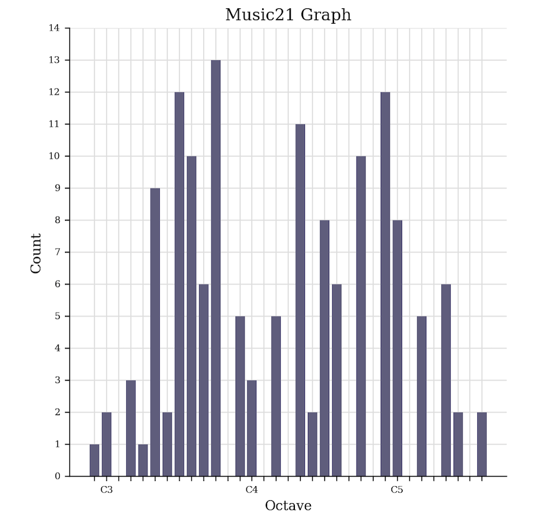
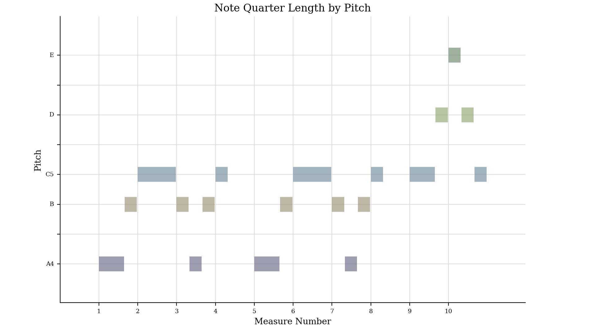

# Week 5

### Task 1 

>Create a metadata schema by listing the elements (or a subset of at least 5 elements)

Song Metadata:

Title: (String) The title of the song.
Duration: (Time) The duration of the song.
Release Date: (Date) The date when the song was released.
Genre: (String) The genre of the song.
Artist: (String) The name of the artist who performed the song.
Album: (String) The name of the album containing the song (if applicable).
Track Number: (Integer) The track number of the song on the album (if applicable).
Lyrics: (Text) The lyrics of the song.
Composer(s): (String or List of Strings) The composer(s) of the song.
Producer(s): (String or List of Strings) The producer(s) of the song.
Language: (String) The language in which the song is sung.
Artist Metadata:

Name: (String) The name of the artist.
Date of Birth: (Date) The date of birth of the artist.
Place of Birth: (String) The place where the artist was born.
Nationality: (String) The nationality of the artist.
Genres: (List of Strings) The genres associated with the artist.
Active Years: (Range of Dates) The period during which the artist was active.
Biography: (Text) A brief biography of the artist.
Discography: (List of Albums) A list of albums released by the artist.
Awards: (List of Strings) Any awards or recognitions received by the artist.
Example Instances:

For a specific song:

Title: "Bohemian Rhapsody"
Duration: 6 minutes 7 seconds
Release Date: November 31, 1975
Genre: Rock
Artist: Queen
For a specific artist:

Name: Freddie Mercury
Date of Birth: September 5, 1946
Place of Birth: Stone Town, Zanzibar
Nationality: British
Genres: Rock, Pop
Active Years: 1969–1991
Biography: A legendary British singer and songwriter, best known as the lead vocalist of the rock band Queen.

### Task 2 

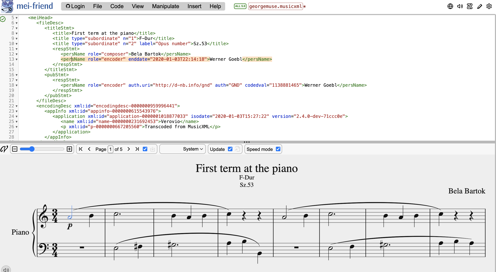

# Week 7 

### Task 1

> Create a second version of your MEI file with the updated metadata. To do this, open your original MEI file and select ‘Save As’. Then, edit your metadata:
Add a genre classifications
Add specific licensing data (consider Creative Commons licenses)
Once added, discuss why you have made the choices you made.

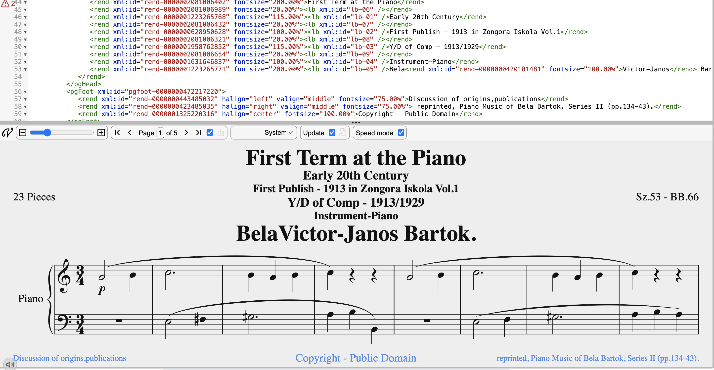

### Task 2

Remember to do this!

# Week 8

### Task 1 

> Identify and download 3 music tracks relating to your theme. Ideally, these should be different in their sound and style.
Identify and list (in a table) the most important technical and non-technical metadata associated with each track.

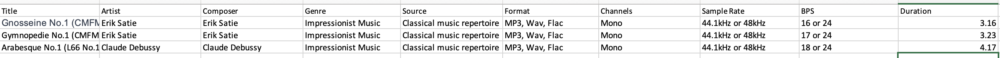

### Task 2

> For each downloaded track, generate a spectrogram (with a log-spaced frequency scale) in SonicVisualizer.
Export the waveform and spectrogram in an image format for your GitHub portfolio.
In 200 words (max), describe at least one advantage of a time-frequency analysis over a waveform-based analysis. Provide at least one example of the identified advantage by referencing a specific subpart of the output from step 1.

##### Debussy Arabesque_No1

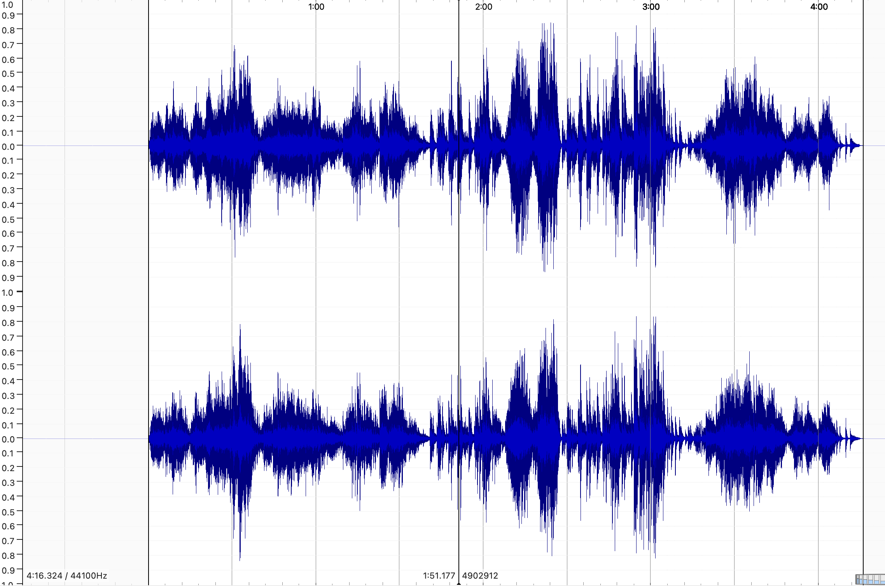

##### Gnoissienne_No1_cmfm

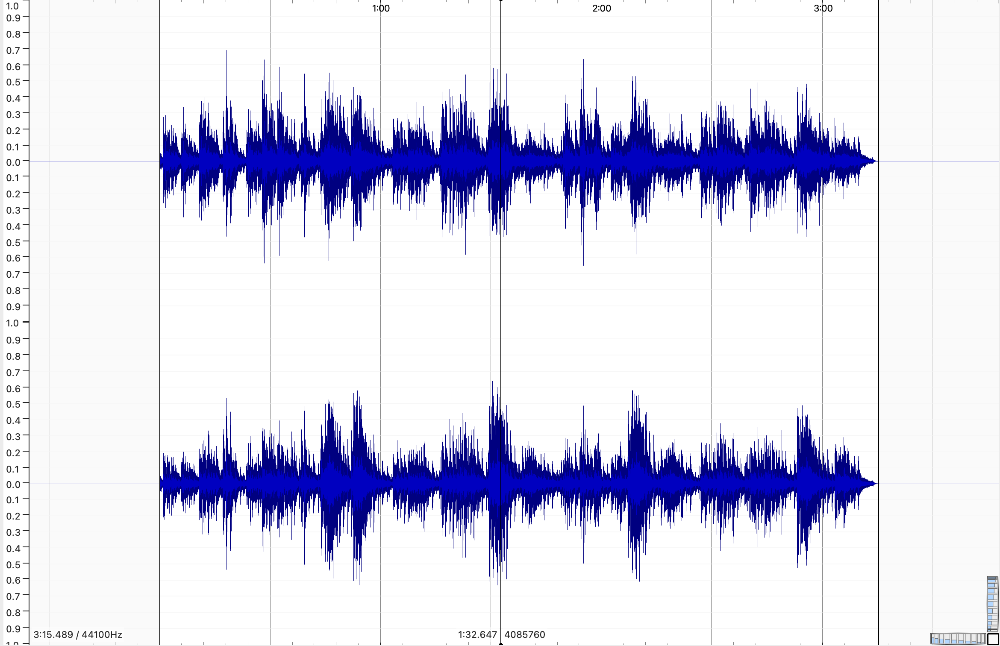

##### gymnopedie_No1_cmfm

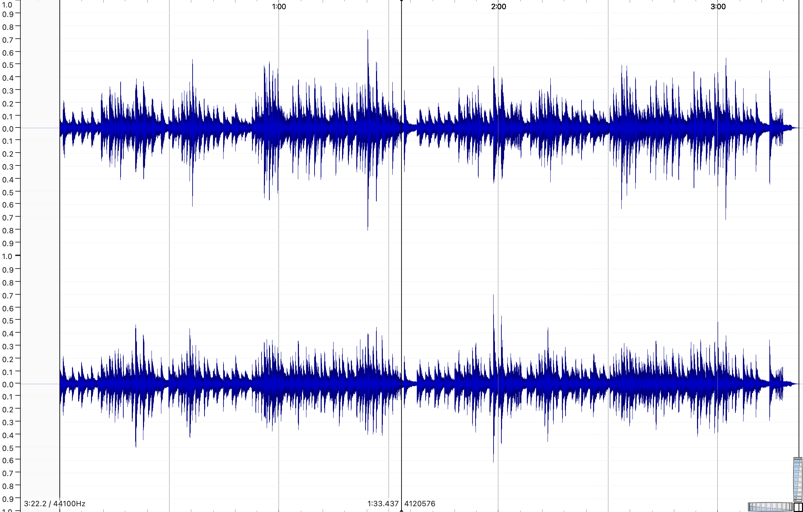

Because time-frequency analysis may reveal dynamic changes in signal frequency across time, it has a clear benefit over waveform-based analysis. One of the best ways to demonstrate this benefit is to look at spectrograms, which show how a signal's frequency content changes over time. Spectrograms provide a thorough, time-localized breakdown of the frequency components present at different points in time, in contrast to waveforms, which show the complete signal in the time domain.

For example, in voice processing, a waveform representation may be able to capture the overall speech signal, but it is not as granular when it comes to vowel formants or pitch shifts. A spectrogram, on the other hand, shows frequency components in a time-varying manner, revealing subtleties like pitch changes during speech or musical notes. This is important because it helps with applications like music analysis and automatic voice recognition, where it is critical to comprehend the temporal evolution of frequency components.

In summary, time-frequency analysis, as demonstrated by spectrograms, has the advantage of being able to reveal the dynamic frequency characteristics of signals, providing a more comprehensive and insightful representation than waveform-based analysis, especially in applications that call for in-depth temporal-frequency insights.

# Week 9

### Task 1

>Load the track and add 3 panes. One should be a Spectrogram, one a Mel Frequency Cepstral Coefficients, and one a Chromagram
Take a screenshot of the panes  (or export the annotation layers as an image)
>
>

##### Debussy Arabesque_No1

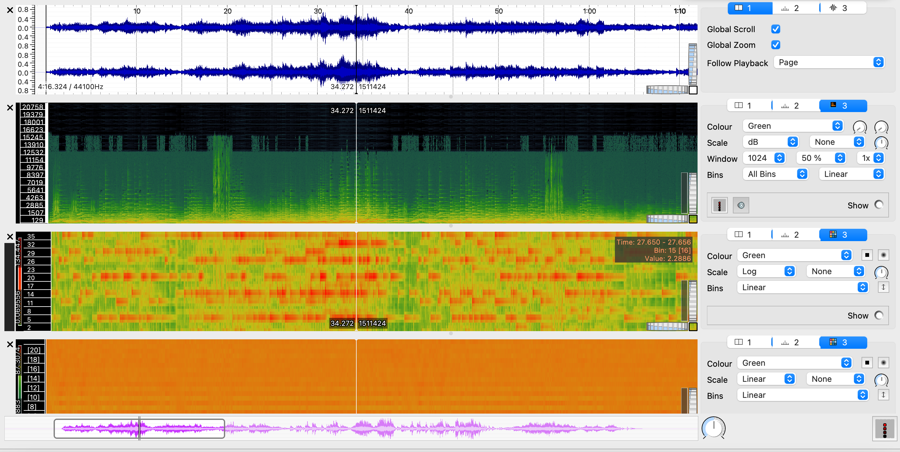

##### Gnoissienne_No1_cmfm

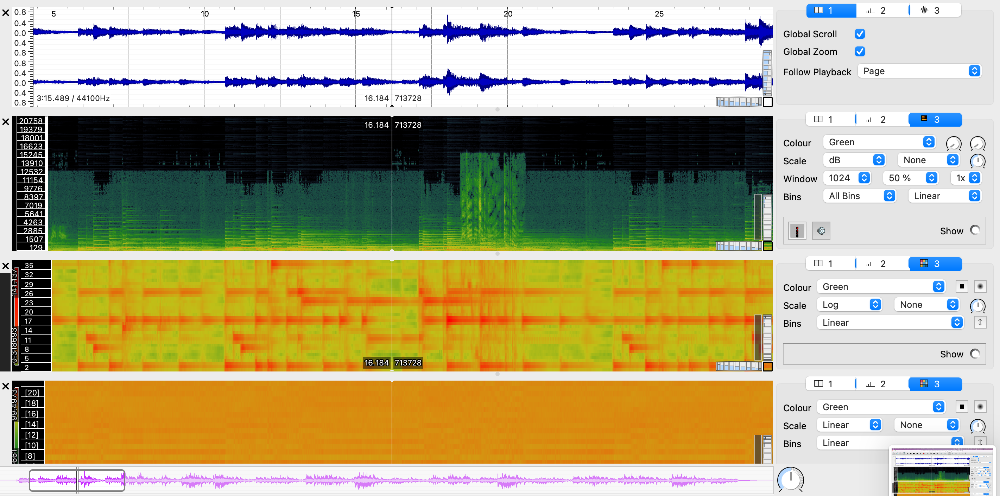

##### gymnopedie_No1_cmfm

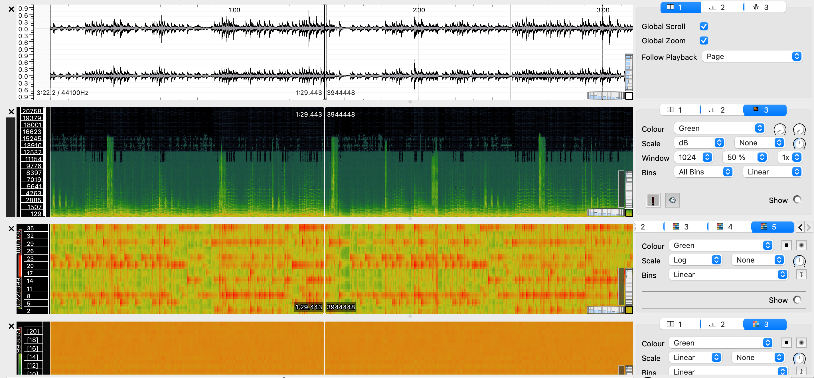

### Task 2

>for each track and feature type extracted in task 1:
In Python (Jupyter notebook or otherwise), load the three CSV files with the raw features
Compute and visualize the histogram of the features for the three tracks

##### Debussy Arabesque_No1

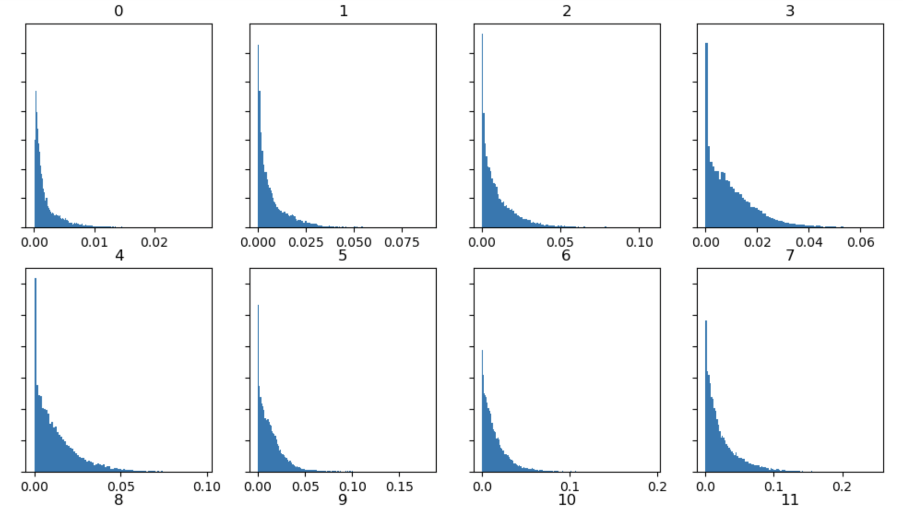
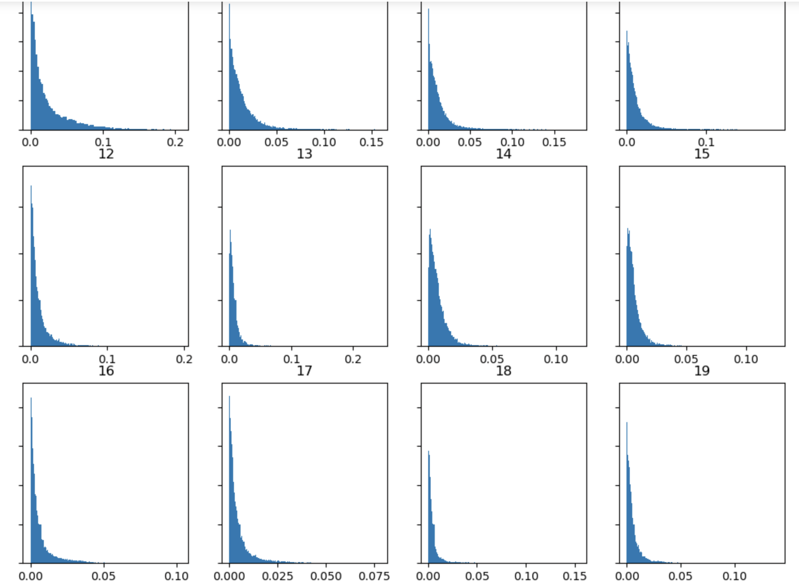

##### Gnoissienne_No1_cmfm

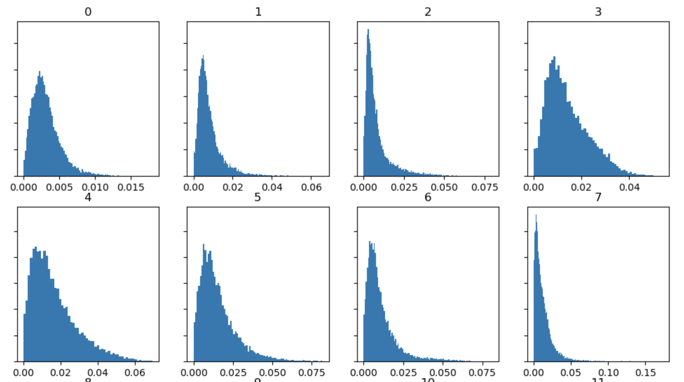
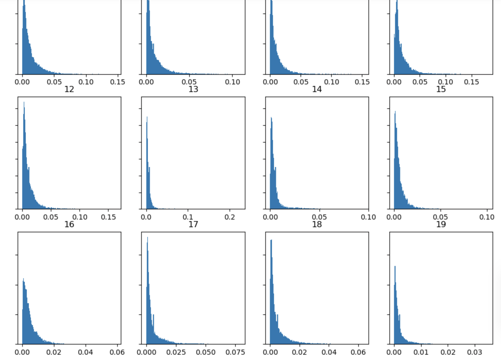

##### gymnopedie_No1_cmfm

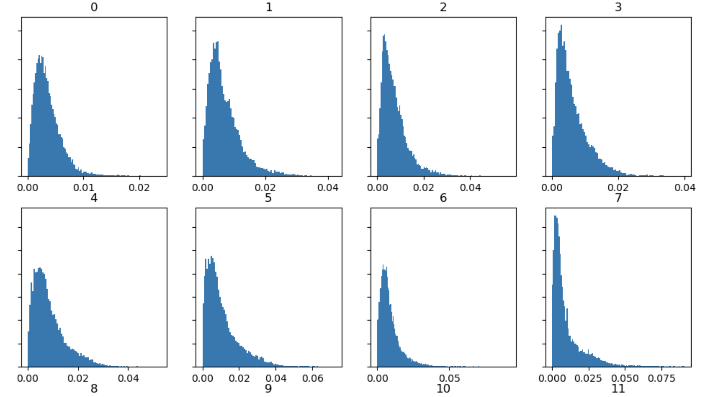
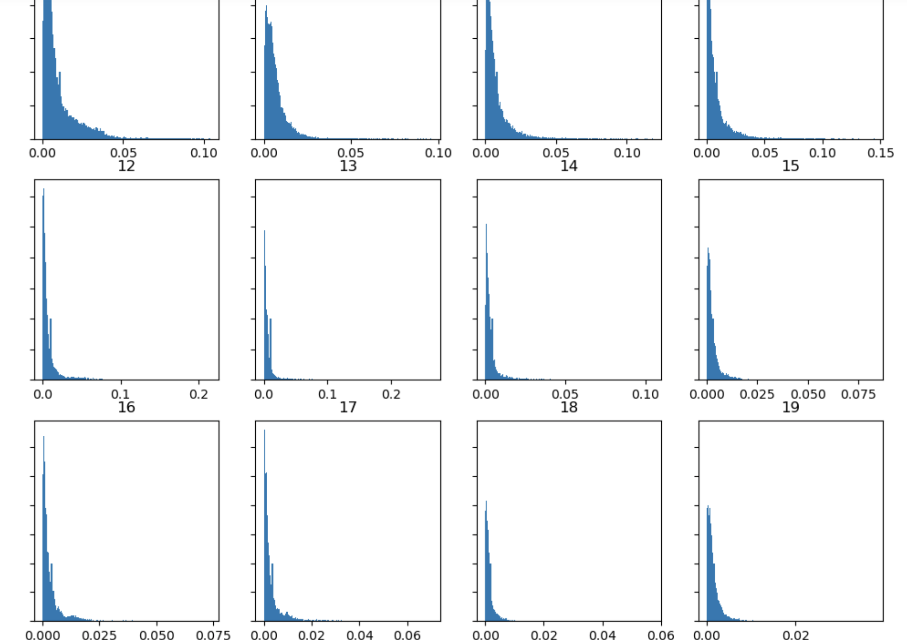

### Task 2.1

>For either the MFCC or Chroma feature, compare the histograms for the 3 tracks and highlight/discuss if the histograms capture significant differences between the tracks and if you expected this difference based on listening to the tracks

You can clearly see the differeneces between the three tracks. you can see the first one has the lowest amount, with the second and third having similar amounts to begine with howevever with number 2 being a lot higher the third one has a much thicker amount. 

